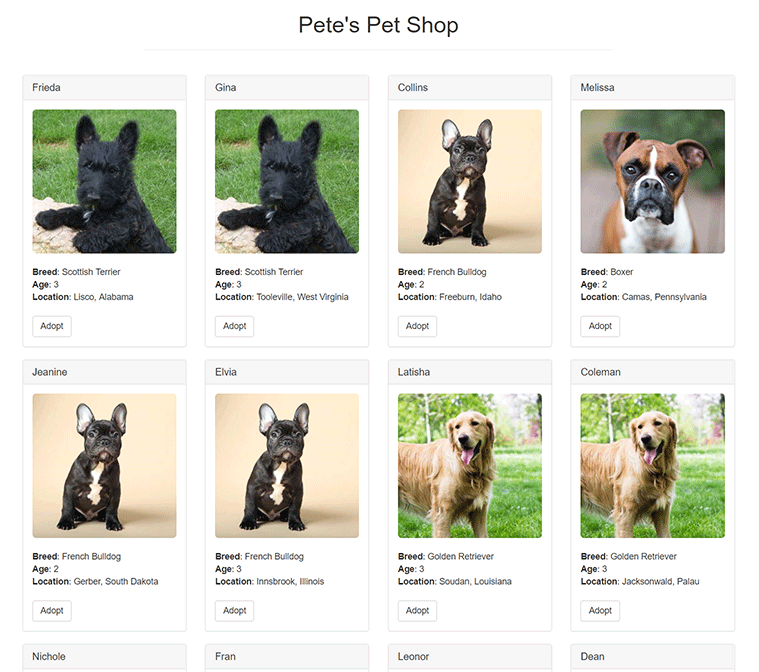

# Pet Shop Adoption Dapp
Complete <a href="https://trufflesuite.com/tutorial/">Dapp Tutorial</a> propvided by Truffle suite.



## Requirement:
- npm
```
sudo apt install npm
```
- node
```
sudo apt install nodejs
```
- Truffle 
```
npm install -g truffle
```

- Ganache -> <a href="https://trufflesuite.com/ganache/">here</a>
- MetaMask -> <a href="https://metamask.zendesk.com/hc/en-us/articles/360015489531-Getting-started-with-MetaMask">here</a>

## How to run:
Open the terminal in the project folder:
- To compile the smart contract
```
truffle compile
```
- Migrate
```
truffle migrate
```
- Test the smart contract
```
truffle test
```
- Start the local web server
```
npm run dev
```
